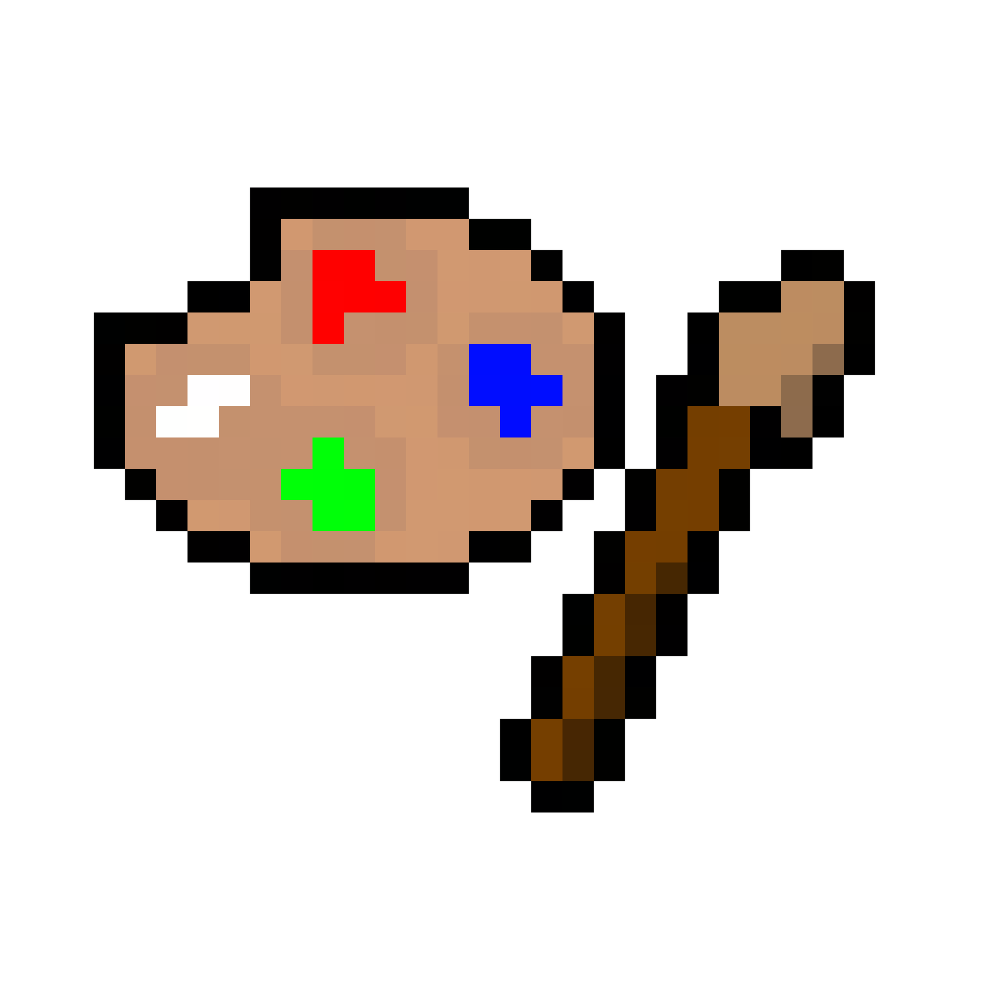
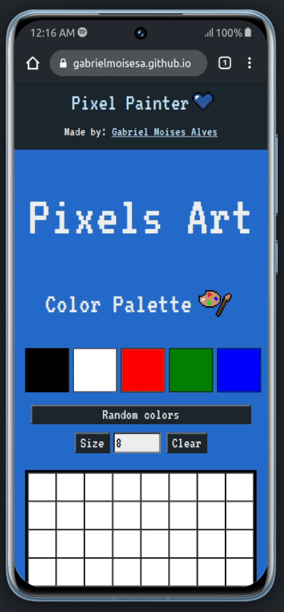

# Pixel Painter 

A pixel art drawing app, made with 

> See the full live preview [here](https://gabrielmoisesa.github.io/pixel-painter/)

## Mobile


## Desktop


## About the project

One of my very first projects, Pixel Painter is a pixel art drawing app made with pure JavaScript.

- Draw pixels with a randomly generated color palette that you can change whenever you want!
- Resize the pixel board from 5 to 12.
- Clear the board with a button.
- **Full responsive** design.
  
### Build with

- 
- 
- 
- 

## Installing and running

```bash
git clone git@github.com:gabrielmoisesa/pixel-painter.git
cd pixel-painter
open index.html
```

## License

This project is under [MIT LICENSE](LICENSE).
